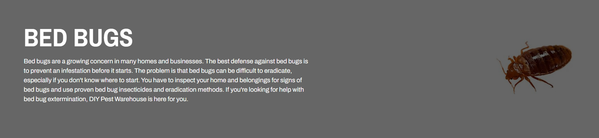
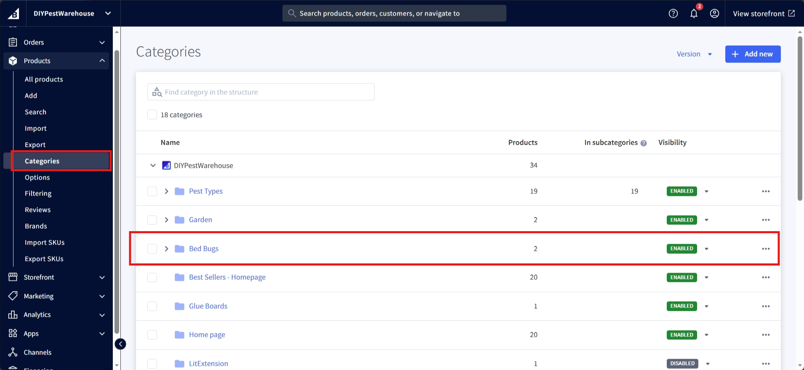
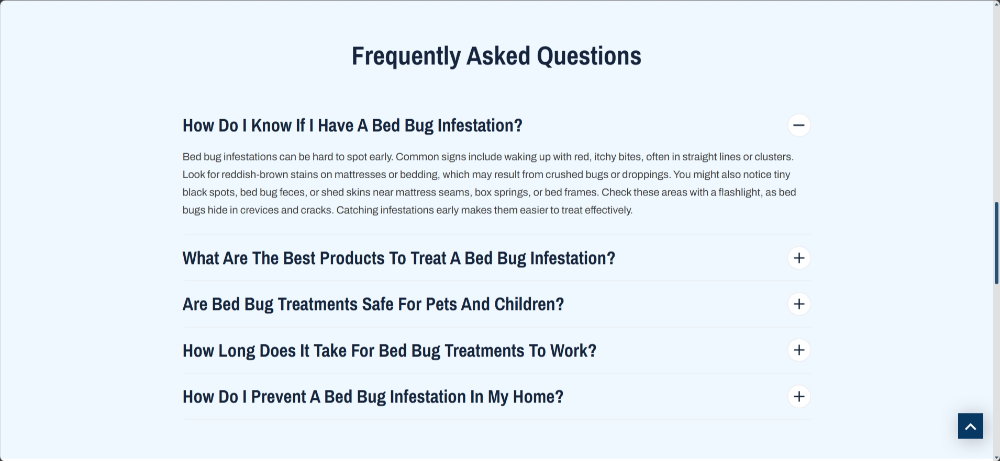
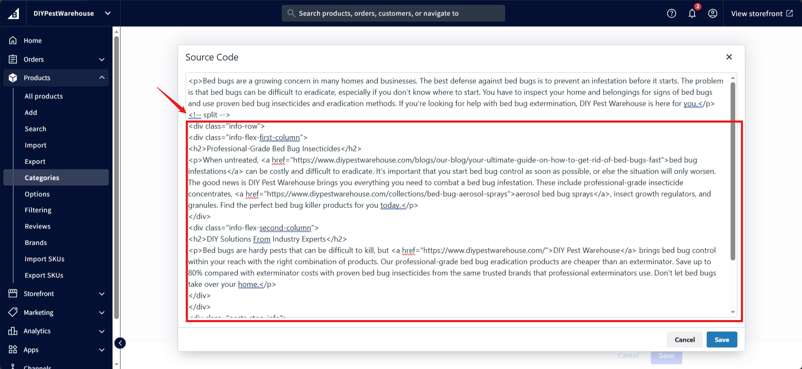

# Category Page
The category page lists all the products in the category.

## Banner


Navigate to <a href="https://store-lr0iyiahf7.mybigcommerce.com/manage/products/categories">category section</a> on the bigcommerce dashboard, and select the category to edit:



### Category Title

Display name of the category is the category title, change it by editing following marked area:


### Category Description

Click the below marked area to open the source code area of the section:


Everything <strong>before</strong> the (```<!-- split -->```) seperator counts as the description of the page, we had to do that because of the migration purposes:


To edit the existing category description, directly edit the part <strong>before</strong> seperator and please make sure the split seperator is as shown in the image and click save buttons.

To add description in the category, then add a description first and end it by adding (```<!-- split -->```), and that will add the description. If  there is already content in it, still first add the description followed by the split seperator and then keep the remaining content as is and click save buttons.

### Category Image

Scroll of the category image section:


Click the three dots to change or delete category banner image.

Save to publish changes.

## Title and Description
It contains the category name and description.

We used the built-in BigCommerce category settings for this.

To edit it, go to the category settings in BigCommerce.

## Filters
The filters are used to filter the products based on the price, brand, and other custom fields.

We used the built-in BigCommerce filters and custom fields for this.

You can see all the available filters going to the 'Filtering' settings in BigCommerce by selecting 'All filters'. You can then select the filters you want to show on the category page.

For more information about the filters, see the <a href="https://support.bigcommerce.com/s/article/Product-Filtering-Settings" target="_blank">BigCommerce documentation</a>.

## Products
It lists all the products in the category.

## FAQ


Copy the following snippet:

```html
<div class="custom-accordion">
    <h3>How do I know if I have a bed bug infestation?</h3>
</div>
<div class="panel">
    <div class="panel-inner">
        <div>
            <p>Bed bug infestations can be hard to spot early. Common signs include waking up with red, itchy bites, often in straight lines or clusters. Look for reddish-brown stains on mattresses or bedding, which may result from crushed bugs or droppings. You might also notice tiny black spots, bed bug feces, or shed skins near mattress seams, box springs, or bed frames. Check these areas with a flashlight, as bed bugs hide in crevices and cracks. Catching infestations early makes them easier to treat effectively.</p>
        </div>
    </div>
</div>

<div class="custom-accordion">
    <h3>What are the best products to treat a bed bug infestation?</h3>
</div>
<div class="panel">
    <div class="panel-inner">
        <div>
            <p>The most effective solution combines multiple products. Bed bug sprays with pyrethrins or pyrethroids kill bed bugs instantly on visible surfaces. Bed bug insecticide dusts are ideal for hidden spaces like wall voids or furniture cracks, providing long-term results. Insect growth regulators (IGRs) help prevent the bugs from reproducing, breaking the infestation cycle. Mattress encasements are also valuable—they trap bed bugs and protect against future infestations. To maximize effectiveness, follow product instructions precisely.</p> 
        </div>
    </div>
</div>

<div class="custom-accordion">
    <h3>Are bed bug treatments safe for pets and children?</h3>
</div>
<div class="panel">
    <div class="panel-inner">
        <div>
            <p>Bed bug treatments can be safe for households if applied properly. Keep pets and children away from treated areas until the product has dried completely. Ensure proper ventilation during and after application. For added safety, botanical or natural-based bed bug killer products are a good alternative though they may not be as effective. Always read product labels carefully and follow guidelines to avoid risks. If unsure about how to use bed bug insecticides, consult a professional pest control expert.</p>
        </div>
    </div>
</div>

<div class="custom-accordion">
    <h3>How long does it take for bed bug treatments to work?</h3>
</div>
<div class="panel">
    <div class="panel-inner">
        <div>
            <p>Treatment duration depends on the severity of the infestation and the thoroughness of your approach. Some sprays kill bed bugs immediately, while others require follow-ups. Expect to repeat treatments every 10–14 days to catch newly hatched bugs. Complete eradication often takes several weeks with consistent application.</p>
        </div>
    </div>
</div>

<div class="custom-accordion">
    <h3>How do I prevent a bed bug infestation in my home?</h3>
</div>
<div class="panel">
    <div class="panel-inner">
        <div>
            <p>Prevention is key to avoiding infestations. Regularly inspect your bedding, especially after traveling. When staying in hotels, check the room for signs of bed bugs before unpacking, and store luggage off the floor. Use mattress encasements and vacuum frequently, focusing on furniture seams and cracks. Avoid bringing in untreated second-hand furniture. With consistent habits and knowledge of how to effectively use bed bug insecticides, you can significantly reduce the risk of infestations.</p> 
        </div>
    </div>
</div>
```

Replace the content and paste it in the following section of the metafield app:

Pending

<!--  -->

## Copy


Copy the following snippet:

```html
<div class="info-row">
    <div class="info-flex-first-column">
        <h2>Professional-Grade Bed Bug Insecticides</h2>
        <p>When untreated, <a href="https://www.diypestwarehouse.com/blogs/our-blog/your-ultimate-guide-on-how-to-get-rid-of-bed-bugs-fast">bed bug infestations</a> can be costly and difficult to eradicate. It's important that you start bed bug control as soon as possible, or else the situation will only worsen. The good news is DIY Pest Warehouse brings you everything you need to combat a bed bug infestation. These include professional-grade insecticide concentrates, <a href="https://www.diypestwarehouse.com/collections/bed-bug-aerosol-sprays">aerosol bed bug sprays</a>, insect growth regulators, and granules. Find the perfect bed bug killer products for you today.</p>
    </div>
    <div class="info-flex-second-column">
        <h2>DIY Solutions From Industry Experts</h2>
        <p>Bed bugs are hardy pests that can be difficult to kill, but <a href="https://www.diypestwarehouse.com/">DIY Pest Warehouse</a> brings bed bug control within your reach with the right combination of products. Our professional-grade bed bug eradication products are cheaper than an exterminator. Save up to 80% compared with exterminator costs with proven bed bug insecticides from the same trusted brands that professional exterminators use. Don't let bed bugs take over your home.</p>
    </div>
</div>
<div class="pests-stop-info">
    <h2>Stop Bugs Bugging You</h2>
    <p>Shop all your <a href="https://www.diypestwarehouse.com/collections">pest control products</a> at DIY Pest Warehouse. Our bed bug insecticides offer complete coverage for your home, office, and car to help you stop bugs from bugging you. Order now and enjoy fast, free shipping in the U.S. Need help? <a href="https://www.diypestwarehouse.com/pages/contact-us">Contact us</a> now.</p>
</div>
```
and paste it <strong>after</strong> the (```<!-- split -->```) seperator as previously was used for description in category banner <a href="#category-description">here</a>. Incase if there is no split seperator then you can add one before the pasted snippet code.



Change the content of the copied snippet code (please refer to the image displayed <a href="#copy">here</a>) and click the save buttons.