# Homepage
The homepage is the main page of the website. It is the first page that the user sees when they visit the website.

## Hero Banner Section

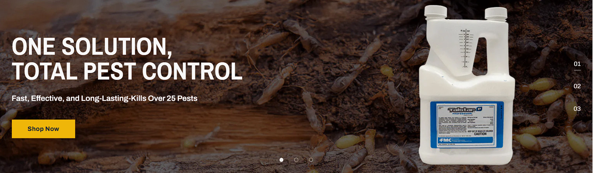

The Hero Banner Carousel is using the built-in BigCommerce Home Page Carousel.
Please follow the <a href="https://support.bigcommerce.com/s/article/Carousel?language=en_US" target="_blank">BigCommerce documentation</a> to see how to manage it.
Please note that the styles are in the theme and should not be changed unless you are confident in your abilities.

## Icon With Text Section

The Icon With Text section is made using a custom widget with an HTML block from the theme called `Block: Icon With Text 1`. You can ready more instructions and even generate a new code following the <a href="https://themes.halothemes.com/documents/bigcommerce-annie-garden/#home_custom_block1" target="_blank">theme's documentation</a>.

## Banner with Text Section

1. The Banner with Text section is made using a custom widget called `Banner with Text`. You can change the content in the [Page Builder](index.md/#page-builder).

2. You can change the text by clicking on it and changing the settings on the left panel. You can change the images and title.

3. Use the plus `+` icon to add new items, and the `< and >` arrow icons to navigate and adjust individual item settings as needed.

4. By clicking on the ellipsis on the top right corner of the left panel, you can change the section settings, like title, image, text and style.
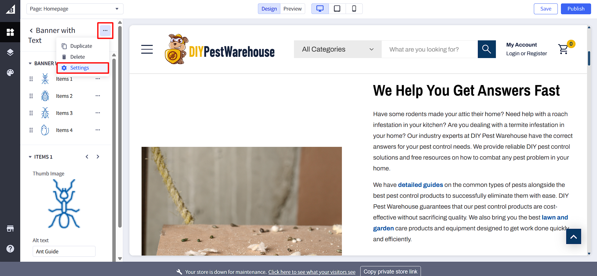

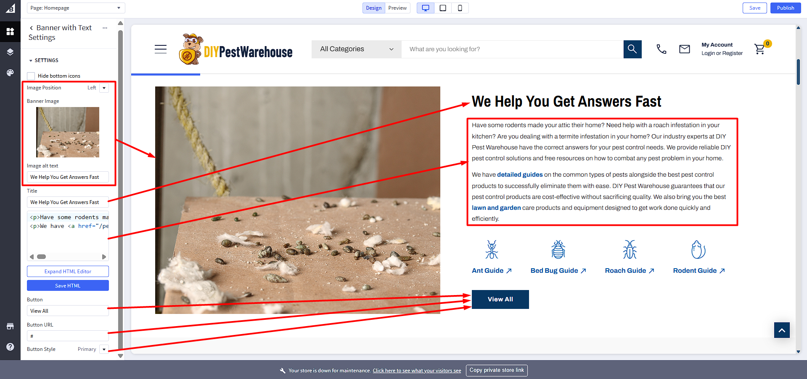

5. Click on the `Save` (to preview the changes) Or `Publish` (to make them live) button.

## Shop by Pest Types Section

1. The Shop by Pest Types section is made using a custom widget called `Shop by Category`. You can change the content in the [Page Builder](index.md/#page-builder).

2. You can change the text by clicking on it and changing the settings on the left panel. You can change the images and title.

3. Use the plus `+` icon to add new items, and the `< and >` arrow icons to navigate and adjust individual item settings as needed.
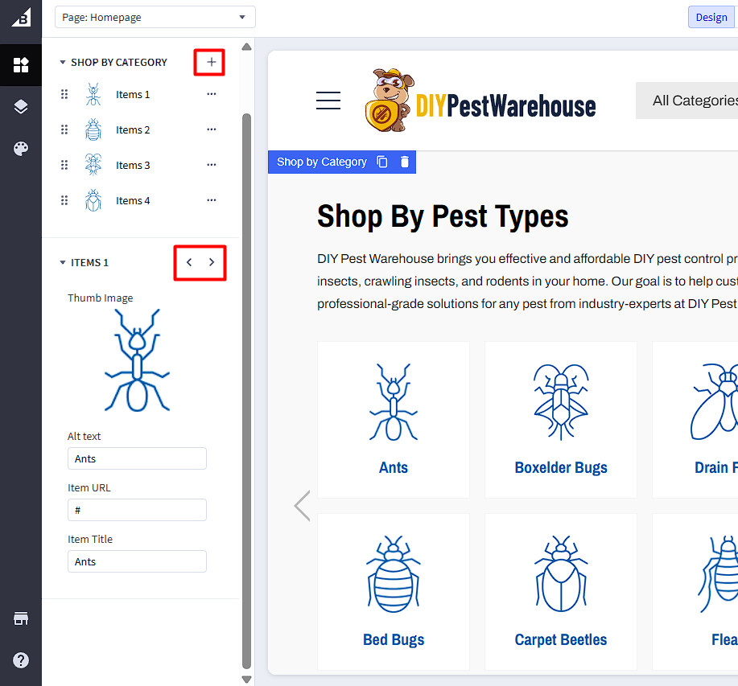

4. By clicking on the ellipsis on the top right corner of the left panel, you can change the section settings, like title, description, image, and style.

5. Click on the `Save` (to preview the changes) Or `Publish` (to make them live) button.

## Featured Products Section
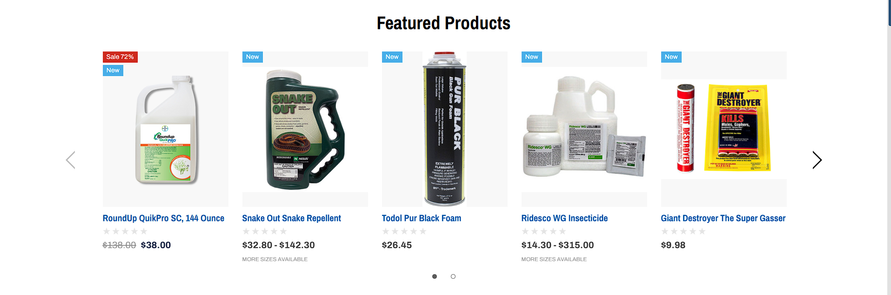

The Featured Products panel displays products that you have marked as Featured.
To mark a product as Featured, simply go to the product listing via Products->View, then click on the star symbol on the product you want to display.

## Best Selling Pest Control Products Section
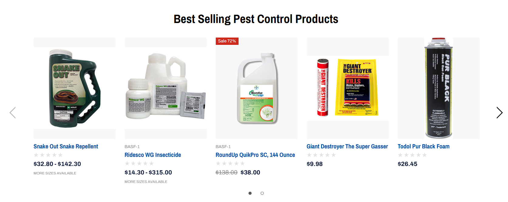

1. The Shop by Category section is made using a custom widget called `Best Selling Products`. You can change the content in the [Page Builder](index.md/#page-builder).

2. You can change the settings on the left panel. You can change the title.

2. Use the plus `+` icon to add new items.

3. Click on the `Save` (to preview the changes) Or `Publish` (to make them live) button.

## Our Products Section

1. The Shop by Category section is made using a custom widget called `Two Col Banner`. You can change the content in the [Page Builder](index.md/#page-builder).

2. You can change the text by clicking on it and changing the settings on the left panel. You can change the title, description and images.

3. Use the plus `+` icon to add new items, and the `< and >` arrow icons to navigate and adjust individual item settings as needed.
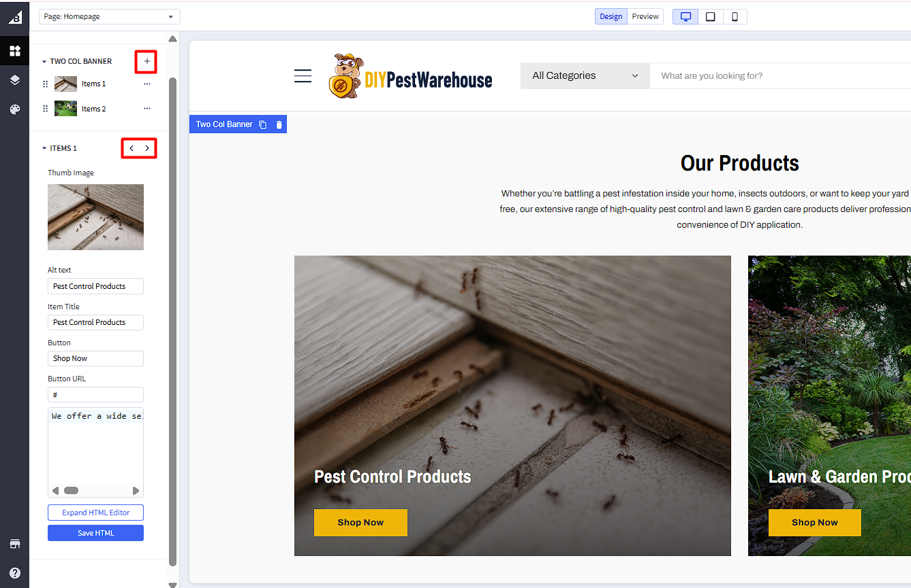

4. By clicking on the ellipsis on the top right corner of the left panel, you can change the section settings, like title, description.
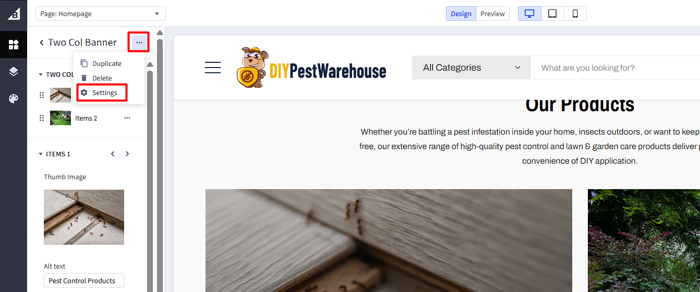
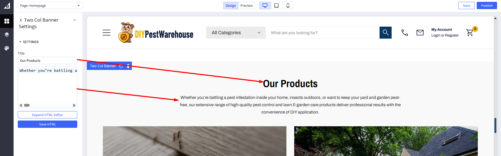

5. Click on the `Save` (to preview the changes) Or `Publish` (to make them live) button.

## Pests by Season Section
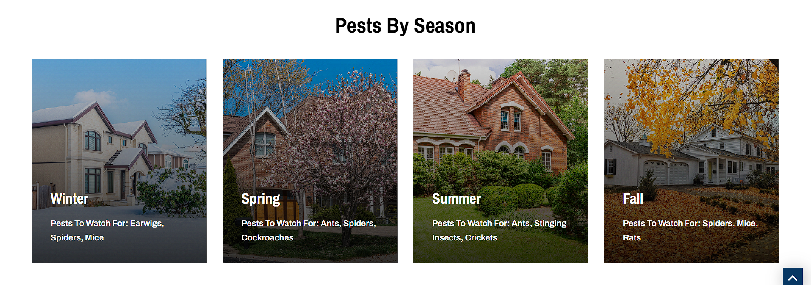

1. The Shop by Category section is made using a custom widget called `Four Col Banner`. You can change the content in the [Page Builder](index.md/#page-builder).

2. You can change the text by clicking on it and changing the settings on the left panel. You can change the title, description and images.

3. Use the plus `+` icon to add new items, and the `< and >` arrow icons to navigate and adjust individual item settings as needed.
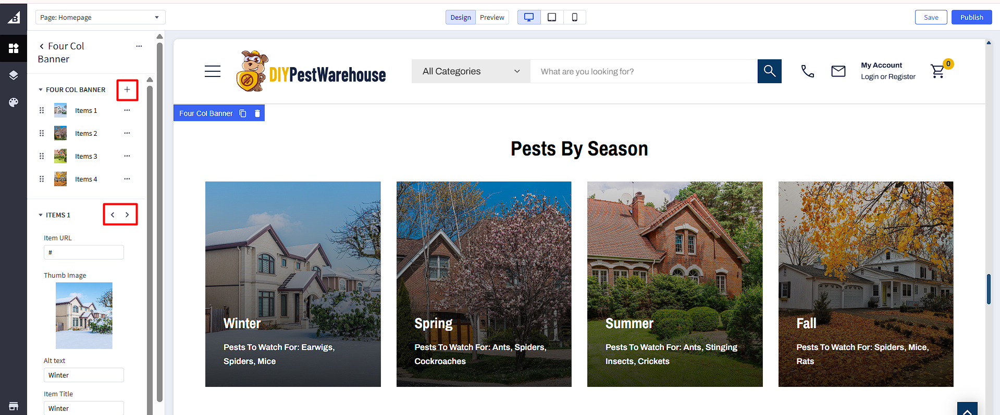

4. By clicking on the ellipsis on the top right corner of the left panel, you can change the section settings, like title.
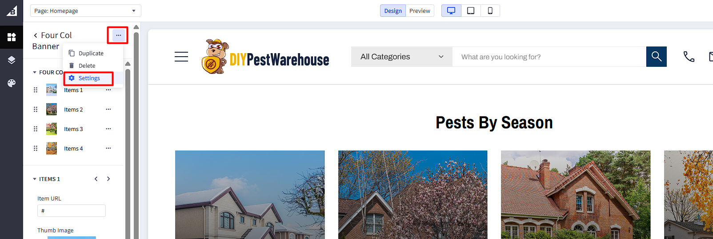
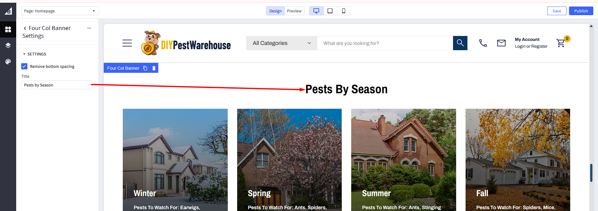

5. Click on the `Save` (to preview the changes) Or `Publish` (to make them live) button.

## Our Blog Section

The Our Blog sections developed by Halothemes. For further details and guidance, please review the <a href="https://themes.halothemes.com/documents/bigcommerce-annie-garden/#home_recent_posts" target="_blank">Halothemes documentation</a>.