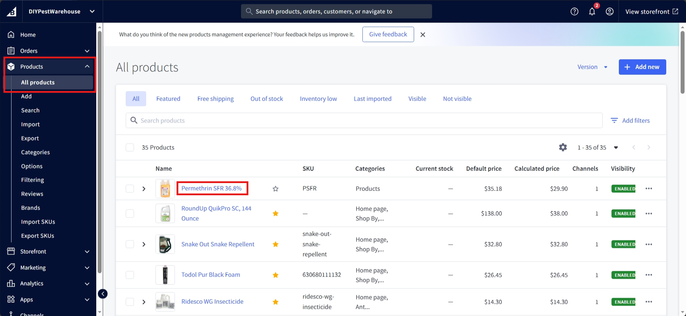
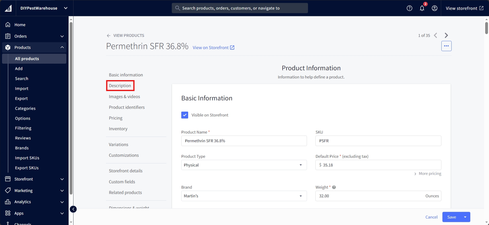
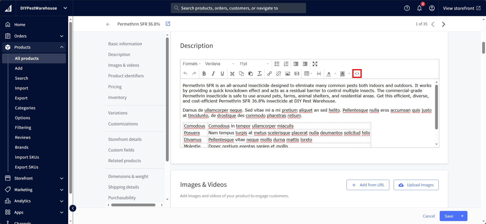
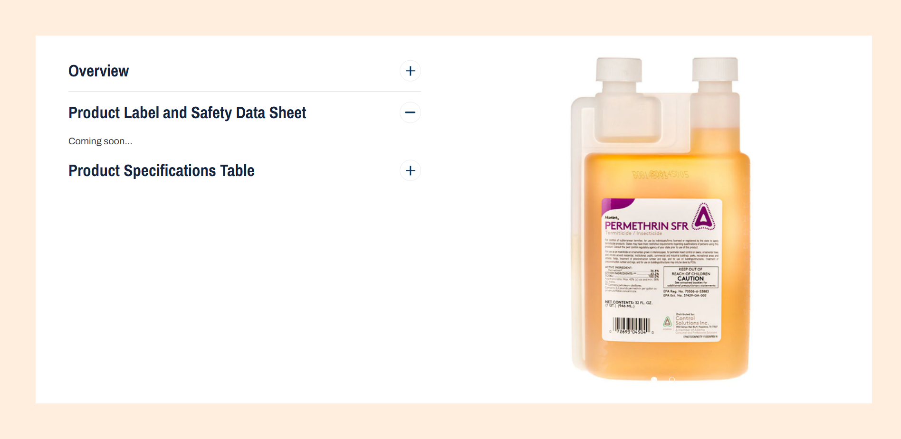
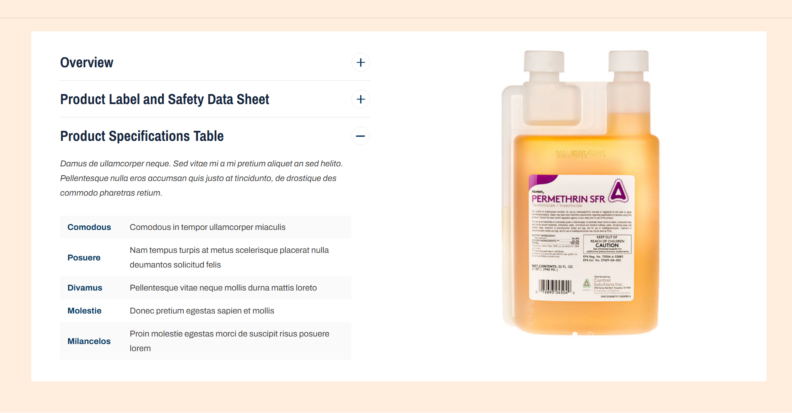
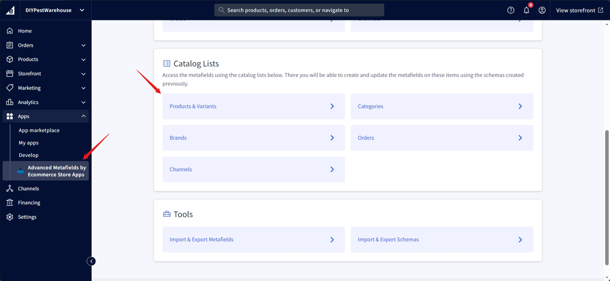
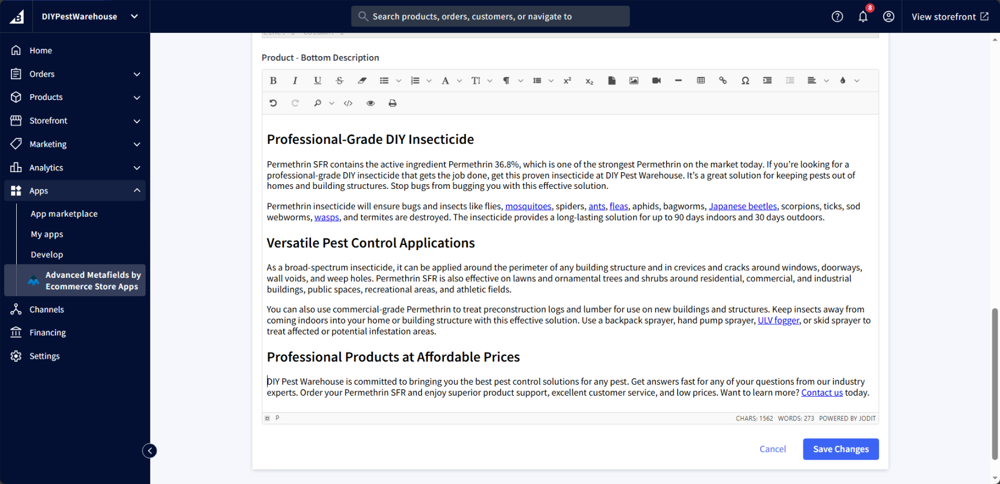
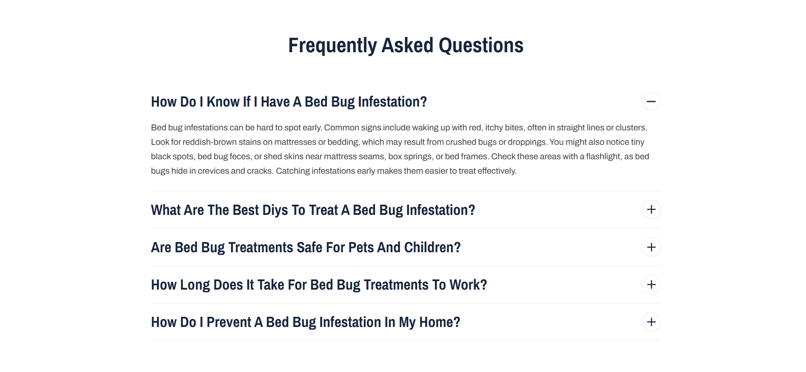
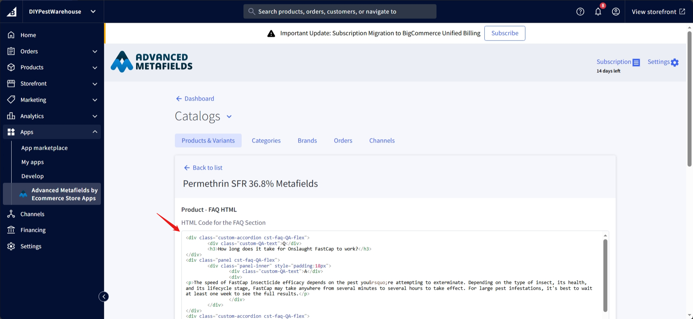

# Product Page
The product page displays the information about the product. It includes the product name, description, price, options, and an image of the product.

Most of the product page is built with the default BigCommerce settings, for more information regarding how to add a product in Bigcommerce with the V2 settings, refer to this <a href="https://support.bigcommerce.com/s/article/Adding-Products-v2?language=en_US" target="_blank">documentation</a>.

## Description/Tab structure

There are some parts on the product page that need to follow specific guidelines.

Note: If `<!-- split -->` is not there then you can add them.

Top description:


Overview Tab:


Product Specifications Table Tab:


## Short/Top Description


The short description is a brief description of the product. It should be a short paragraph that describes the product in a few sentences. The short description should be displayed at the top of the product page.
It is not mandatory, so not all the products will have it.

Navigate to <a href="https://store-lr0iyiahf7.mybigcommerce.com/manage/products">product section</a> on the bigcommerce dashboard, and select the product to edit:



Click the Description tab in product page:





Please refer to top description <a href="/product/#descriptiontab-structure">here.</a>

## Custom Product tabs


### Overview Tab


Navigate to <a href="https://store-lr0iyiahf7.mybigcommerce.com/manage/products">product section</a> on the bigcommerce dashboard, and select the product to edit:


Click the Description tab in product page:


Please refer to Overview tab <a href="/product/#descriptiontab-structure">here.</a>

### Product Data Sheet Tab



Navigate to <a href="https://store-lr0iyiahf7.mybigcommerce.com/manage/products">product section</a> on the bigcommerce dashboard, and select the product to edit:


Click the custom field link to scroll to the Product custom field section:


To add PDF, please use following structure:

PDF 1 IMAGE
<br>
PDF 1 LINK

PDF 2 IMAGE
<br>
PDF 2 LINK

and so on, we support 12 PDF, so you can keep iterating the number up to 12.

### Product Specific Table Tab



Copy the following code snippet and replace the content between the start and end tag:

```html
<div class="halo-custom-tab" data-custom-tab="Product Specifications Table">

    <!-- Remove below content and replace it with your content - Starts here -->
    <p>Damus de ullamcorper neque. Sed vitae mi a mi pretium aliquet an sed helito. Pellentesque nulla eros accumsan quis justo at tincidunto, de drostique des commodo pharetras retium.</p>
    <div class="scrollable-wrapper">
        <table>
            <tbody>
                <tr>
                    <td class="tb-title">Comodous</td>
                    <td>Comodous in tempor ullamcorper miaculis</td>
                </tr>
                <tr>
                    <td class="tb-title">Posuere</td>
                    <td>Nam tempus turpis at metus scelerisque placerat nulla deumantos solicitud felis</td>
                </tr>
                <tr>
                    <td class="tb-title">Divamus</td>
                    <td>Pellentesque vitae neque mollis durna mattis loreto</td>
                </tr>
                <tr>
                    <td class="tb-title">Molestie</td>
                    <td>Donec pretium egestas sapien et mollis</td>
                </tr>
                <tr>
                    <td class="tb-title">Milancelos</td>
                    <td>Proin molestie egestas morci de suscipit risus posuere lorem</td>
                </tr>
                <tr>
                    <td class="tb-title">Cosmopolis</td>
                    <td>Pellentesque diam dolor, elementum etos lobortis des mollis</td>
                </tr>
            </tbody>
        </table>
    </div>
    <!-- End here -->
</div>
```
To change tab title replace (``` Product Specifications Table ```) in (``` data-custom-tab="Product Specifications Table" ```) with your desired title in above copied snippet code.


Navigate back to the description tab as previously did on <a href="#overview-tab">Overview tab</a>, 


Paste the code right after the description added for the overview tab. If there is no content paste it directly in the empty space, make sure the `<!-- split -->` is there, please refer Product Specifications Table Tab <a href="/product/#descriptiontab-structure">here.</a>

Click Ok and Save to publish.

### More info


Navigate to Metafield app through this <a href="https://store-lr0iyiahf7.mybigcommerce.com/manage/app/39776">link</a>.



Select the product from the list as marked below:


Add content on Product - Bottom Description to display under More Info:



Click save changes to publish.

## FAQ


Copy the following snippet:

```html
<div class="custom-accordion cst-faq-QA-flex">
        <div class="custom-QA-text">Q</div>
        <h3>How long does it take for Onslaught FastCap to work?</h3>
</div>
<div class="panel cst-faq-QA-flex">
        <div class="panel-inner" style="padding:18px">
                <div class="custom-QA-text">A</div>
                <div>
<p>The speed of FastCap insecticide efficacy depends on the pest you&rsquo;re attempting to exterminate. Depending on the type of insect, its health, and its lifecycle stage, FastCap may take anywhere from several minutes to several hours to take effect. For large pest infestations, it's best to wait at least one week to see the full results.</p>
                </div>
        </div>
</div>
<div class="custom-accordion cst-faq-QA-flex">
        <div class="custom-QA-text">Q</div>
        <h3>What is the mixing ratio for Onslaught FastCap?</h3>
</div>
<div class="panel cst-faq-QA-flex">
        <div class="panel-inner" style="padding:18px">
                <div class="custom-QA-text">A</div>
                <div>
<p>For moderate or low infestations, mix half an ounce of Onslaught FastCap spider and scorpion insecticide with one gallon of water. For heavy infestations, mix one full ounce with one gallon of water. The final mixture should be enough to cover 1,000 square feet.</p>
                </div>
        </div>

</div>
<div class="custom-accordion cst-faq-QA-flex">
        <div class="custom-QA-text">Q</div>
        <h3>How long does the residual effect of FastCap pesticide last indoors and outdoors?</h3>
</div>
<div class="panel cst-faq-QA-flex">
        <div class="panel-inner" style="padding:18px">
                <div class="custom-QA-text">A</div>
                <div>
<p>Residual control from Onslaught FastCap works as a surface or <a href="https://www.diypestwarehouse.com/collections/ant-sprays">spot treatment</a>. You can expect a single treatment to provide residual control between 30 and 90 days. Do not spray within 24 hours of expected rainfall, as the product will not be effective.</p>
                </div>
        </div>
</div>
```

```json
{
  "@context": "https://schema.org",
  "@type": "FAQPage",
  "mainEntity": [
    {
      "@type": "Question",
      "name": "What pests does Bora-Care treat?",
      "acceptedAnswer": {
        "@type": "Answer",
        "text": "Bora-Care spray can control a variety of termites and beetles, carpenter ants, fungi, and algae. This product targets pests that harm wood products, including home-building materials, furniture, and flooring."
      }
    },
    {
      "@type": "Question",
      "name": "What is the mixing ratio for Bora-Care termiticide?",
      "acceptedAnswer": {
        "@type": "Answer",
        "text": "The mixing ratio is dependent on your use case and infestation levels. Please refer to the label to learn more about which ratio is appropriate for your needs."
      }
    },
    {
      "@type": "Question",
      "name": "How long does Bora-Care last?",
      "acceptedAnswer": {
        "@type": "Answer",
        "text": "This product is designed to last for the lifetime of the wood. However, you may need to apply multiple treatments depending on the infestation."
      }
    },
    {
      "@type": "Question",
      "name": "Is Bora-Care toxic to humans or dogs?",
      "acceptedAnswer": {
        "@type": "Answer",
        "text": "You should always wear gloves and eye protection when applying this termiticide. However, you don’t need to wear a respirator unless the application is in an enclosed space. Once dry, this product is completely safe for children and pets."
      }
    }
  ]
}
```

Replace the content and paste it in the following section of the metafield app:

Navigate to Metafield app through this <a href="https://store-lr0iyiahf7.mybigcommerce.com/manage/app/39776">link</a>.


Select the product from the list as marked below:


Replace or edit the part of the HTML in below section:



Replace or edit the part of the Schema in below section and save the changes:


## Related Items or You May Also Like

The related items section displays products that are related to the current product. These are usually automatically picked by BigCommerce or can be set manually in the product settings.
Please refer to the BigCommerce <a href="https://support.bigcommerce.com/s/article/Adding-Products-v2?language=en_US#related" target="_blank">documentation</a> for more details.
